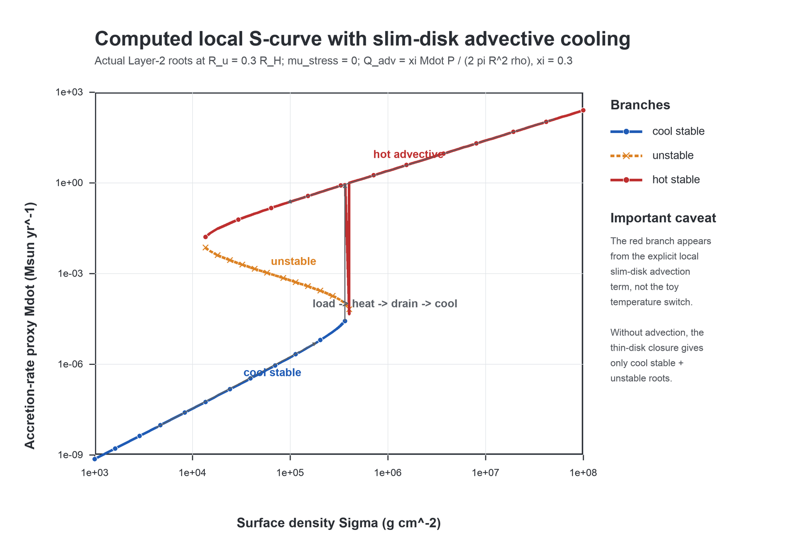
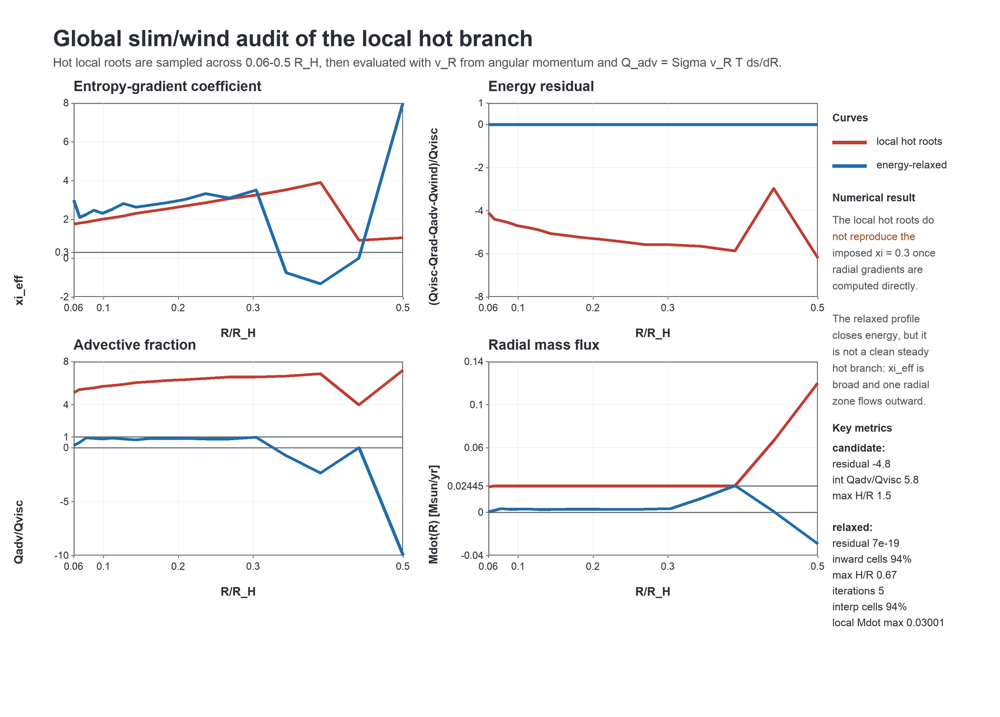
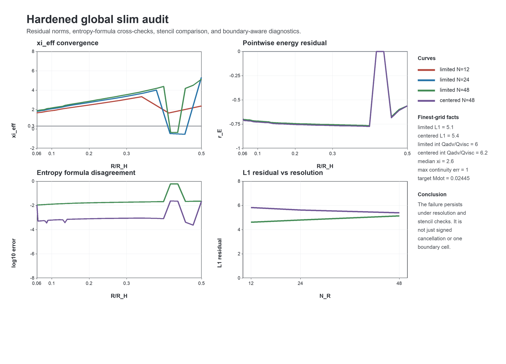
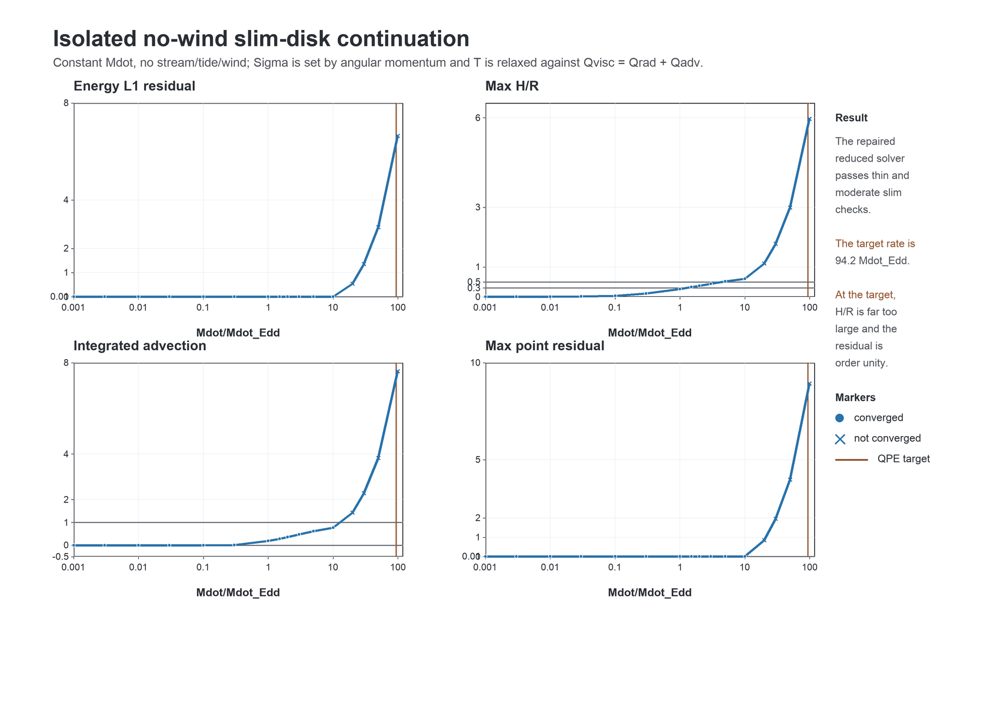
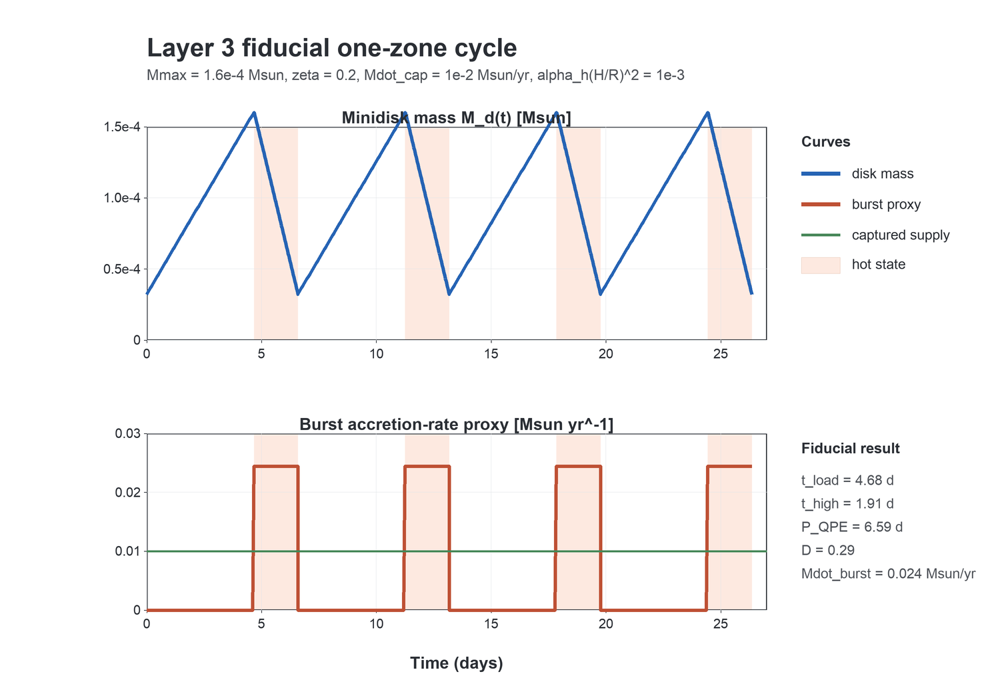

# IMRI QPE Model

This repository implements a semi-analytic/numerical model for QPEs from an
intermediate-mass-ratio inspiral embedded in a transient TDE disk.

## Current Implementation

- cgs constants and unit conversions,
- fiducial IMRI parameters from the note,
- analytic fiducial scale estimates,
- Layer-1 Hill-flow and shock-stress diagnostics,
- Layer-2 vertical-equilibrium and local S-curve diagnostics,
- Layer-3 one-zone cycle, prototype 1D minidisk diffusion tools, and
  global slim/wind energy diagnostics,
- standard-library unit tests.

## Main Results So Far

### Fiducial scales

The code reproduces the scale estimates in the research note for

```text
M_smbh = 1e6 Msun
M2     = 1e4 Msun
a      = 50 r_g,smbh
R_u    = 0.3 R_H
alpha_c = 0.01
```

Key regression anchors:

```text
R_H          ~= 1.10e12 cm
R_u          ~= 3.31e11 cm
Omega_K(R_u) ~= 6.05e-3 s^-1
T_tr         ~= 2.08e6 K
Sigma_tr     ~= 9.41e5 g cm^-2
Mcrit        ~= 1.6e-4 Msun
```

### Layer 2 S-curve

The local vertical-equilibrium solver computes roots of

```text
Q_visc+ + Q_stream+ = Q_rad- + Q_adv- + Q_wind-
```

The baseline thin-disk closure, with no advection or wind, gives the expected
cool stable branch plus a radiation-pressure unstable branch for
`mu_stress = 0`. Gas-pressure-like stress suppresses the instability.

The current local slim-disk advection diagnostic is

```text
Q_adv = xi * Mdot * P / (2 pi R^2 rho)
```

where `xi` is a dimensionless radial entropy-gradient coefficient. The
addendum in `Note/CODEX_SLIM_WIND_UPGRADE.md` correctly warns that `xi` should
be a diagnostic from a radial solution, not an imposed parameter. Therefore the
following figure is a useful local target, not yet proof of a physical global
hot branch. With `xi = 0.3`, the local model produces a stable advective hot
branch:



Compact scan at `R_u = 0.3 R_H`, `mu_stress = 0`, `alpha = 0.01`:

| xi | DeltaM scale | Hot branch includes 0.024 Msun/yr? |
|---:|---:|:---|
| 0.03 | 6.9e-5 Msun | yes |
| 0.1  | 6.8e-5 Msun | yes |
| 0.3  | 6.7e-5 Msun | yes |
| 1    | 6.5e-5 Msun | yes |
| 3    | 6.2e-5 Msun | yes |
| 10   | 5.6e-5 Msun | yes |

This is encouraging: with local advective cooling of plausible magnitude, the
participating mass scale remains in the note's target range and the hot branch
covers the Layer-3 fiducial burst rate. The result should now be interpreted as
a target for the global radial solver.

### Global slim/wind audit

The near-term global upgrade now computes

```text
v_R(R) from angular-momentum transport
T ds/dR = de/dR - P/rho^2 d rho/dR
Q_adv  = Sigma v_R T ds/dR
xi_eff = - R rho/P * T ds/dR
```

It also includes energy-limited wind cooling with a non-negative radiation
floor. The first global audit takes the local hot-branch roots across
`0.06-0.5 R_H`, evaluates their actual radial entropy advection, and then runs
a fixed-Sigma temperature relaxation against the global energy residual.



Main outcome: the local `xi = 0.3` hot branch is **not** yet a faithful global
hot branch. The local-root candidate gives median `xi_eff ~= 2.2`, integrated
`Q_adv/Q_visc ~= 5.8`, and a global energy residual of `-4.8`. The relaxed
profile can close the formal energy residual, but it has broad `xi_eff`,
integrated `Q_adv/Q_visc ~= -0.09`, and one outward-flow radial zone. This is a
diagnostic failure of the parameterized hot branch, not a validated physical
limit cycle.

Sprint-A audit hardening adds L1/L2/max residuals, boundary-aware metrics, an
independent entropy-gradient formula, manufactured entropy tests, stencil
comparison, and `Mdot` continuity residuals. The hardened audit confirms that
the failure is not just signed cancellation, a single boundary cell, or the
slope limiter:



Summary table:

```text
outputs/tables/global_slim_audit_hardened.md
```

### Sprint B isolated slim benchmark

The isolated no-wind benchmark now imposes constant `Mdot`, turns off stream,
tide, and wind, and solves the Keplerian angular-momentum and energy
equations simultaneously for `Sigma(R)` and `T(R)` against

```text
Q_visc = Q_rad + Q_adv
```

The repaired benchmark recovers the low-rate thin disk and follows a smooth
reduced advective sequence through moderate super-Eddington rates:



Summary table:

```text
outputs/tables/isolated_slim_branch_summary.md
```

For `10^-3 <= Mdot/Mdot_Edd <= 10`, the energy residual is small
(`L1 < 1e-3`). The advective fraction rises from negligible values to
`Q_adv/Q_visc ~= 0.77` by `Mdot/Mdot_Edd = 10`. The physical caveat is now
geometric rather than an immediate thin-disk solver failure: `H/R` crosses
`0.3` near `Mdot/Mdot_Edd ~= 1.5` and `0.4` near `Mdot/Mdot_Edd ~= 3`, so the
nearly Keplerian reduction is no longer trustworthy well below the QPE burst
target `Mdot/Mdot_Edd ~= 94`. Near that target the reduced solver has
order-unity residuals and unphysical thickness. The next step is therefore a
transonic slim-disk solver with radial momentum and sonic regularity, before
stream, tide, or wind are reintroduced.

### Layer 3 one-zone cycle

The reduced relaxation oscillator reproduces the fiducial day-scale recurrence:

```text
t_load      = 4.6752 d
t_high      = 1.9122 d
P_QPE       = 6.5874 d
duty cycle  = 0.2903
Mdot_burst  = 0.02445 Msun/yr
```



## Slim/Wind Upgrade Status

After reading `Note/CODEX_SLIM_WIND_UPGRADE.md`, the main caveat is sharpened:
`Q_adv` must be computed from radial entropy advection, not imposed through
constant `xi`. The code now includes first-step entropy/advection diagnostics:

```text
T ds/dR = de/dR - P/rho^2 d rho/dR
Q_adv  = Sigma v_R T ds/dR
xi_eff = - R rho/P * T ds/dR
Mdot   = -2 pi R Sigma v_R
```

These are implemented in `src/imri_qpe/layer3_minidisk_1d/entropy_advection.py`.
The code also includes energy-limited wind helpers in
`src/imri_qpe/layer3_minidisk_1d/winds.py`.

The near-term global diagnostic is implemented, but the full physical
calculation still remains to be done. In particular, the model does not yet
self-consistently evolve

```text
v_R(R), Mdot(R), ds/dR, dotSigma_w, l_w, Q_wind, tau_wind, R_ph.
```

It also does not solve radial momentum or impose a transonic inner boundary
condition, so the current global result should be read as a consistency audit,
not as a complete slim-disk solution.

A short audit of this revised interpretation is saved at
`outputs/tables/slim_wind_upgrade_audit.md`.

## Questions For External Advice

The most useful feedback now would be on how to replace the remaining
parameterized hot-branch physics with a faithful slim-disk/wind closure.

Suggested prompt:

```text
I am implementing an IMRI minidisk limit-cycle model for QPEs. The local
vertical-equilibrium solver currently computes S-curves using cgs units,
electron-scattering opacity, alpha stress

  tau_Rphi = alpha P_gas^mu P_tot^(1-mu),

and radiative cooling

  Q_rad = 16 sigma_SB T_c^4 / (3 kappa Sigma).

Without advection, mu_stress = 0 gives a cool stable branch plus a
radiation-pressure unstable branch but no stable hot branch. I added a local
slim-disk-like advection estimate

  Q_adv = xi * Mdot * P / (2 pi R^2 rho),

where Mdot is inferred from local viscous heating. For xi ~ 0.03-10, the
solver produces a stable advective hot branch and a participating mass of
~6e-5 Msun at R_u = 0.3 R_H for M_smbh = 1e6 Msun and M2 = 1e4 Msun.

The caveat is that xi is imposed. How should I upgrade this to a faithful
slim-disk or wind-stabilized hot branch? Specifically:

1. What vertically integrated slim-disk energy equation should I implement
   so Q_adv is computed from Sigma(R), T_c(R), v_R(R), and ds/dR?
2. What boundary conditions and closure for v_R/Mdot are appropriate for a
   tidally truncated, stream-fed circumsecondary disk?
3. Should wind mass loss be implemented as dMdot/dR, and if so which
   prescription is best for super-Eddington IMBH minidisks?
4. How should wind angular-momentum and energy loss enter the 1D equations?
5. What tests would distinguish a real stable slim/wind branch from an
   artifact of the local parameterization?
```

Relevant local references:

- `literature/1988ApJ...332..646A` - Abramowicz et al. 1988, slim disks.
- `literature/Pan_2022_ApJL_928_L18.pdf` - QPE disk-instability model.
- `literature/2211.00704v1.pdf` - magnetic pressure/advection in TDE/QPE disks.
- `literature/Hirose_2009_ApJ_691_16.pdf` and
  `literature/Jiang_2013_ApJ_778_65.pdf` - radiation-MHD stability cautions.

## Running Tests

Run the current tests with:

```bash
PYTHONPATH=src python3 -m unittest discover -s tests
```

Current expected result:

```text
Ran 71 tests
OK
```
